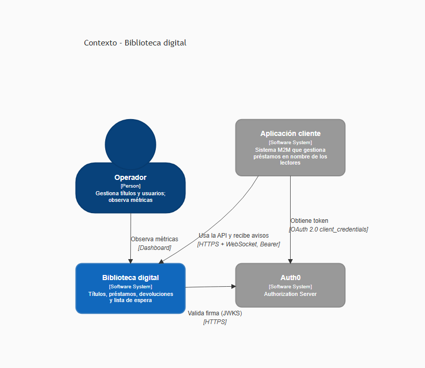
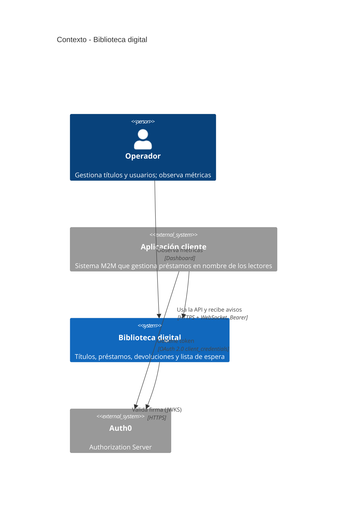

# C4 – Nivel 1: Contexto

Muestra el sistema como una caja negra, junto con quién lo usa y con qué sistemas externos se relaciona.
Los consumidores son aplicaciones (Machine to Machine), por eso la aplicación cliente es un sistema externo y no una persona.

