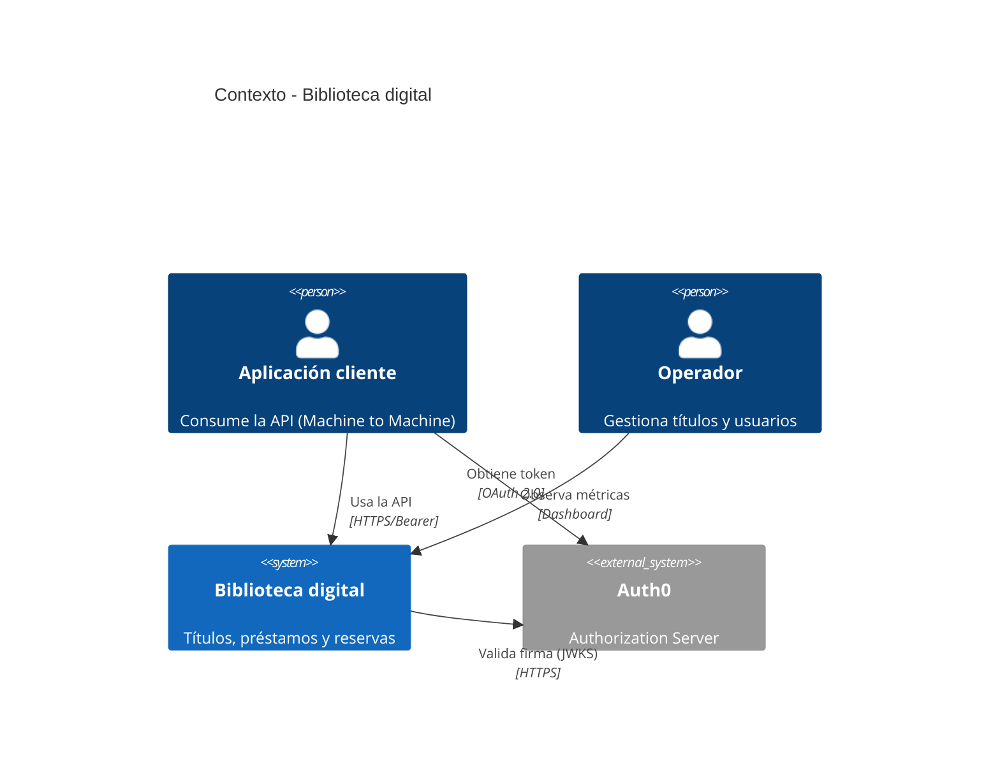

# C4 – Nivel 1: Contexto

Muestra el sistema como una caja negra, junto con quién lo usa y con qué sistemas externos se relaciona.

```mermaid
C4Context
  title Contexto - Biblioteca digital

  UpdateLayoutConfig($c4ShapeInRow="2", $c4BoundaryInRow="1")

  Person(cliente, "Aplicación cliente", "Consume la API (Machine to Machine)")
  Person(operador, "Operador", "Gestiona títulos y usuarios")

  System(biblioteca, "Biblioteca digital", "Títulos, préstamos y reservas")

  System_Ext(auth0, "Auth0", "Authorization Server")

  Rel(cliente, auth0, "Obtiene token", "OAuth 2.0")
  Rel(cliente, biblioteca, "Usa la API", "HTTPS/Bearer")
  Rel(operador, biblioteca, "Observa métricas", "Dashboard")
  Rel(biblioteca, auth0, "Valida firma (JWKS)", "HTTPS")

  UpdateRelStyle(cliente, auth0, $offsetX="-40", $offsetY="-15")
  UpdateRelStyle(cliente, biblioteca, $offsetX="10", $offsetY="10")
  UpdateRelStyle(biblioteca, auth0, $offsetX="10", $offsetY="30")
```
