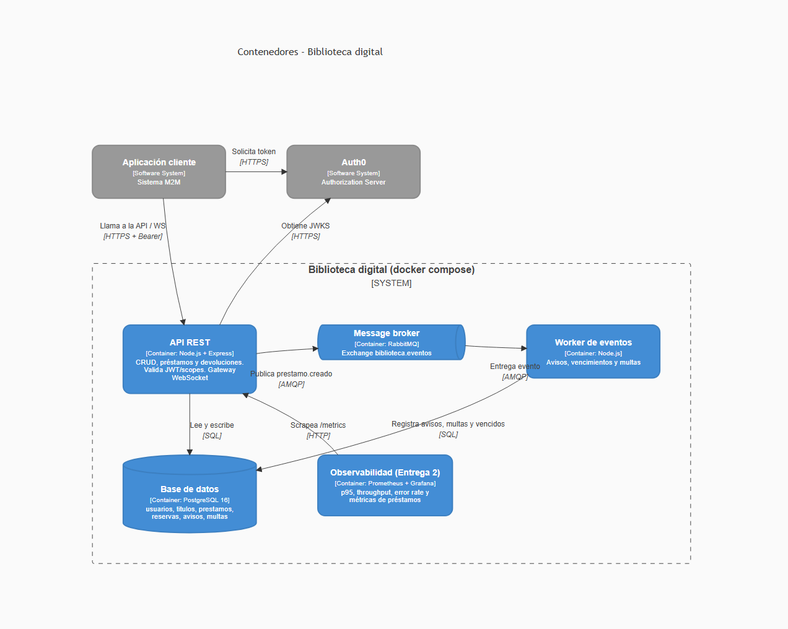
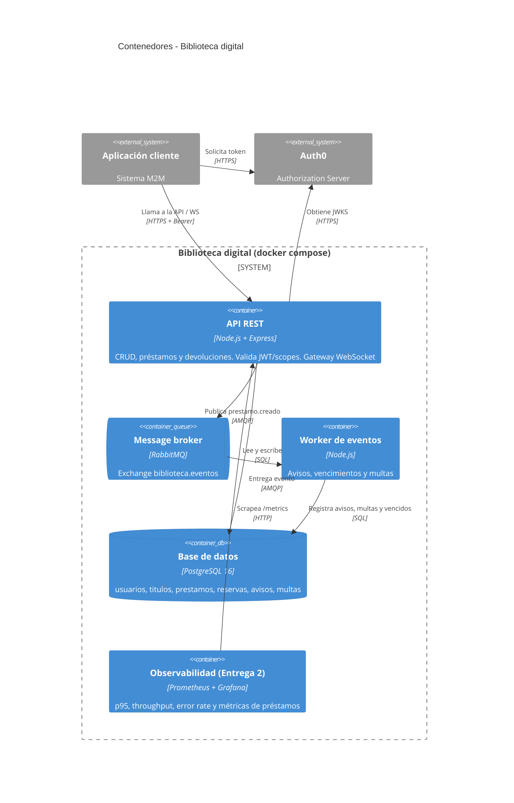

# C4 – Nivel 2: Contenedores

Los contenedores `api`, `worker`, `db` y `broker` existen en `docker-compose.yml` (placeholders en la Entrega 1).
Observabilidad (Prometheus + Grafana) se agrega en la Entrega 2.

Métricas de negocio previstas (además de p95, throughput y error rate): préstamos activos, préstamos vencidos,
reservas en espera y avisos enviados.
