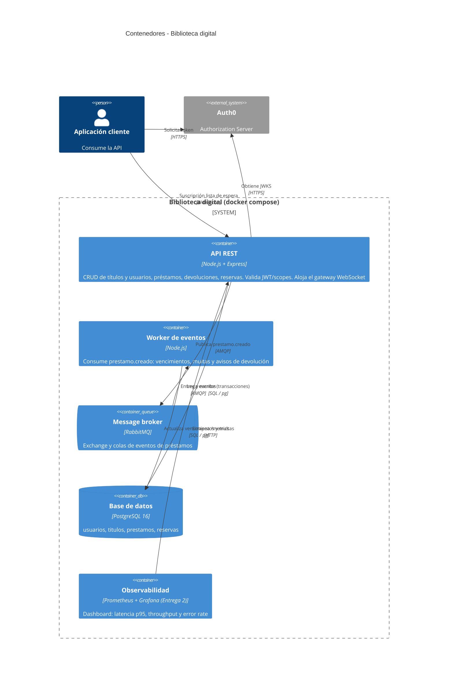

# C4 – Nivel 2: Contenedores

```mermaid
C4Container
  title Contenedores - Biblioteca digital

  Person(cliente, "Aplicación cliente", "Consume la API")
  System_Ext(auth0, "Auth0", "Authorization Server")

  System_Boundary(sys, "Biblioteca digital (docker compose)") {
    Container(api, "API REST", "Node.js + Express", "CRUD de títulos y usuarios, préstamos, devoluciones, reservas. Valida JWT/scopes. Aloja el gateway WebSocket")
    Container(worker, "Worker de eventos", "Node.js", "Consume prestamo.creado: vencimientos, multas y avisos de devolución")
    ContainerQueue(broker, "Message broker", "RabbitMQ", "Exchange y colas de eventos de préstamos")
    ContainerDb(db, "Base de datos", "PostgreSQL 16", "usuarios, titulos, prestamos, reservas")
    Container(obs, "Observabilidad", "Prometheus + Grafana (Entrega 2)", "Dashboard: latencia p95, throughput y error rate")
  }

  Rel(cliente, auth0, "Solicita token", "HTTPS")
  Rel(cliente, api, "Llama a la API", "HTTPS/JSON + Bearer")
  Rel(cliente, api, "Suscripción lista de espera", "WebSocket")
  Rel(api, auth0, "Obtiene JWKS", "HTTPS")
  Rel(api, db, "Lee y escribe (transacciones)", "SQL / pg")
  Rel(api, broker, "Publica prestamo.creado", "AMQP")
  Rel(broker, worker, "Entrega eventos", "AMQP")
  Rel(worker, db, "Actualiza vencimientos y multas", "SQL / pg")
  Rel(obs, api, "Scrapea /metrics", "HTTP")
```
