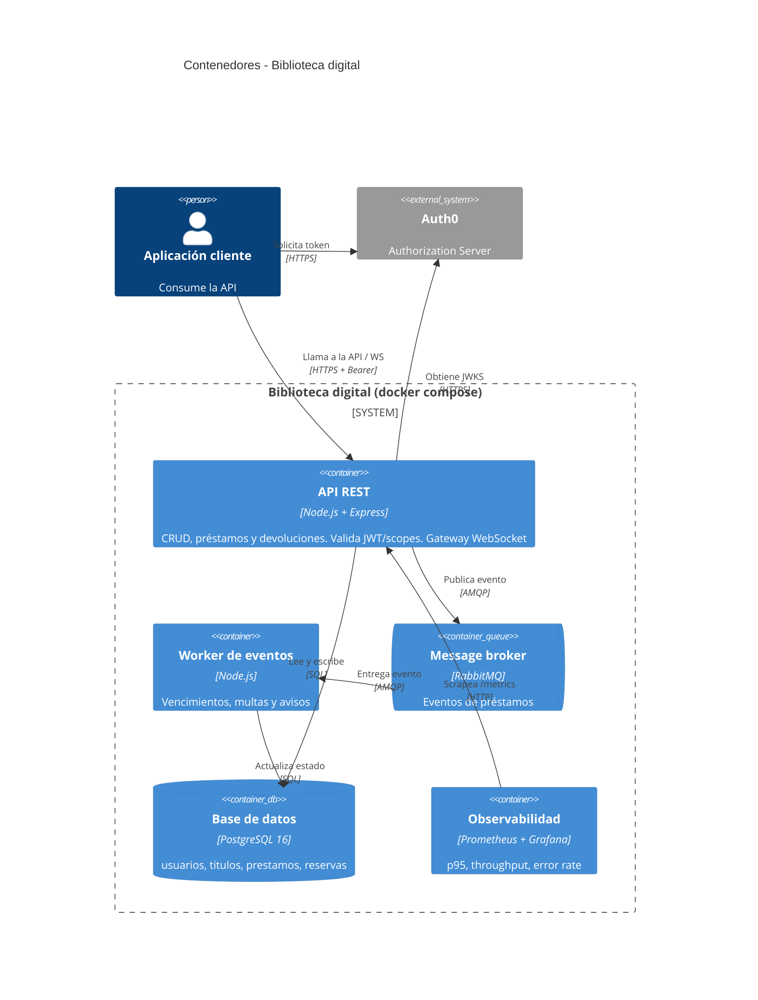

# C4 – Nivel 2: Contenedores

```mermaid
C4Container
  title Contenedores - Biblioteca digital

  UpdateLayoutConfig($c4ShapeInRow="3", $c4BoundaryInRow="1")

  Person(cliente, "Aplicación cliente", "Consume la API")
  System_Ext(auth0, "Auth0", "Authorization Server")

  System_Boundary(sys, "Biblioteca digital (docker compose)") {
    Container(api, "API REST", "Node.js + Express", "CRUD, préstamos y devoluciones. Valida JWT/scopes. Gateway WebSocket")
    Container(worker, "Worker de eventos", "Node.js", "Vencimientos, multas y avisos")
    ContainerQueue(broker, "Message broker", "RabbitMQ", "Eventos de préstamos")
    ContainerDb(db, "Base de datos", "PostgreSQL 16", "usuarios, titulos, prestamos, reservas")
    Container(obs, "Observabilidad", "Prometheus + Grafana", "p95, throughput, error rate")
  }

  Rel(cliente, auth0, "Solicita token", "HTTPS")
  Rel(cliente, api, "Llama a la API / WS", "HTTPS + Bearer")
  Rel(api, auth0, "Obtiene JWKS", "HTTPS")
  Rel(api, db, "Lee y escribe", "SQL")
  Rel(api, broker, "Publica evento", "AMQP")
  Rel(broker, worker, "Entrega evento", "AMQP")
  Rel(worker, db, "Actualiza estado", "SQL")
  Rel(obs, api, "Scrapea /metrics", "HTTP")

  UpdateRelStyle(cliente, auth0, $offsetX="-60", $offsetY="-10")
  UpdateRelStyle(cliente, api, $offsetX="10", $offsetY="-30")
  UpdateRelStyle(api, auth0, $offsetX="10", $offsetY="20")
  UpdateRelStyle(api, db, $offsetX="-40", $offsetY="-10")
  UpdateRelStyle(api, broker, $offsetX="10", $offsetY="-10")
  UpdateRelStyle(broker, worker, $offsetX="0", $offsetY="-15")
  UpdateRelStyle(worker, db, $offsetX="-20", $offsetY="20")
  UpdateRelStyle(obs, api, $offsetX="0", $offsetY="20")
```
