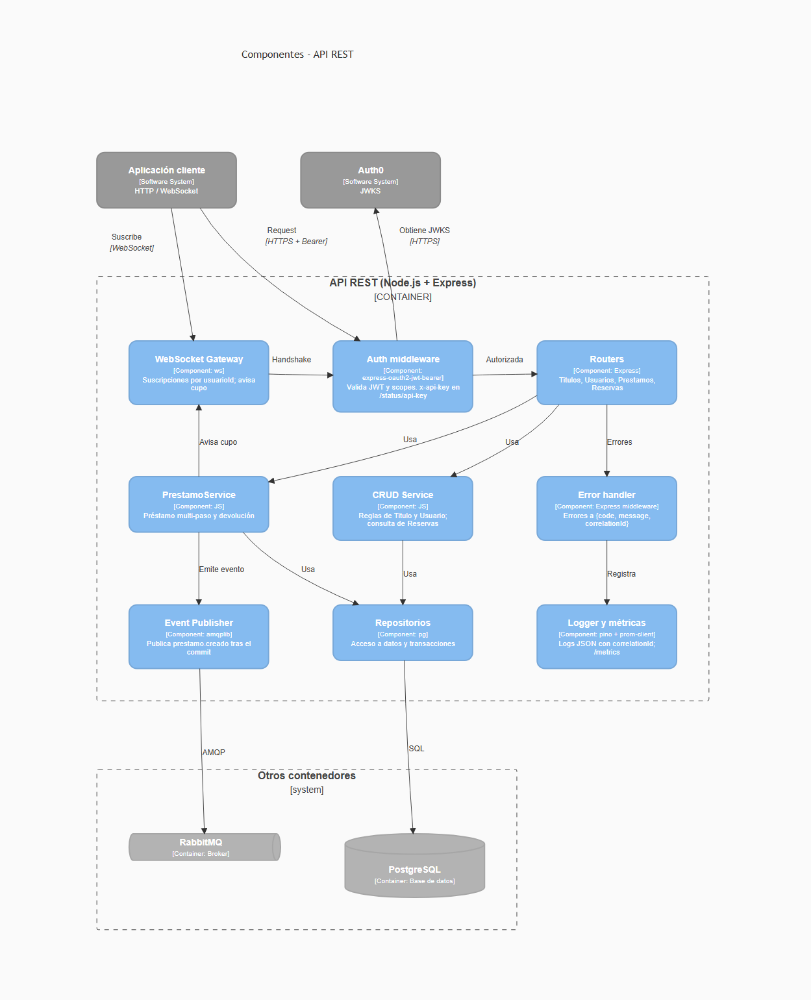
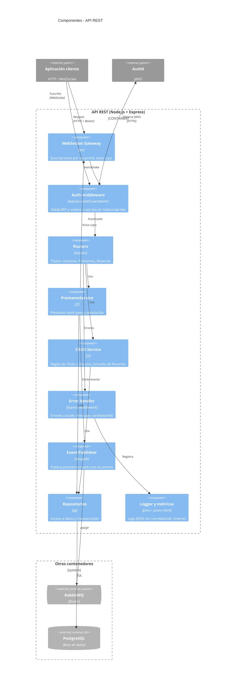

# C4 – Nivel 3: Componentes (contenedor API REST)

El worker es un proceso simple (consumidor + job de vencimientos) y no se detalla en este nivel; su
comportamiento está en el [ADR 004](../adr/004-broker-rabbitmq.md).
