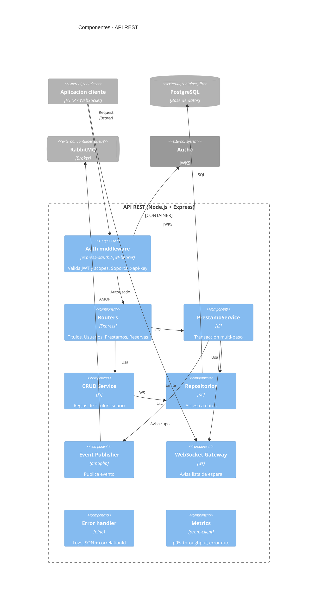

# C4 – Nivel 3: Componentes (contenedor API REST)

```mermaid
C4Component
  title Componentes - API REST

  UpdateLayoutConfig($c4ShapeInRow="3", $c4BoundaryInRow="1")

  Container_Ext(cliente, "Aplicación cliente", "HTTP / WebSocket")
  ContainerDb_Ext(db, "PostgreSQL", "Base de datos")
  ContainerQueue_Ext(broker, "RabbitMQ", "Broker")
  System_Ext(auth0, "Auth0", "JWKS")

  Container_Boundary(api, "API REST (Node.js + Express)") {
    Component(authmw, "Auth middleware", "express-oauth2-jwt-bearer", "Valida JWT y scopes. Soporta x-api-key")
    Component(routers, "Routers", "Express", "Titulos, Usuarios, Prestamos, Reservas")
    Component(prestamosvc, "PrestamoService", "JS", "Transacción multi-paso")
    Component(crudsvc, "CRUD Service", "JS", "Reglas de Titulo/Usuario")
    Component(repo, "Repositorios", "pg", "Acceso a datos")
    Component(publisher, "Event Publisher", "amqplib", "Publica evento")
    Component(wsgw, "WebSocket Gateway", "ws", "Avisa lista de espera")
    Component(errmw, "Error handler", "pino", "Logs JSON + correlationId")
    Component(metrics, "Metrics", "prom-client", "p95, throughput, error rate")
  }

  Rel(cliente, authmw, "Request", "Bearer")
  Rel(authmw, auth0, "JWKS")
  Rel(authmw, routers, "Autorizado")
  Rel(routers, prestamosvc, "Usa")
  Rel(routers, crudsvc, "Usa")
  Rel(prestamosvc, repo, "Usa")
  Rel(crudsvc, repo, "Usa")
  Rel(prestamosvc, publisher, "Emite")
  Rel(prestamosvc, wsgw, "Avisa cupo")
  Rel(repo, db, "SQL")
  Rel(publisher, broker, "AMQP")
  Rel(cliente, wsgw, "WS")

  UpdateRelStyle(cliente, authmw, $offsetX="0", $offsetY="-180")
  UpdateRelStyle(authmw, auth0, $offsetX="20", $offsetY="70")
  UpdateRelStyle(authmw, routers, $offsetX="-30", $offsetY="10")
  UpdateRelStyle(routers, prestamosvc, $offsetX="-40", $offsetY="0")
  UpdateRelStyle(routers, crudsvc, $offsetX="20", $offsetY="15")
  UpdateRelStyle(prestamosvc, repo, $offsetX="-30", $offsetY="0")
  UpdateRelStyle(crudsvc, repo, $offsetX="20", $offsetY="15")
  UpdateRelStyle(prestamosvc, publisher, $offsetX="0", $offsetY="-20")
  UpdateRelStyle(prestamosvc, wsgw, $offsetX="-200", $offsetY="100")
  UpdateRelStyle(repo, db, $offsetX="10", $offsetY="-200")
  UpdateRelStyle(publisher, broker, $offsetX="20", $offsetY="-10")
  UpdateRelStyle(cliente, wsgw, $offsetX="-10", $offsetY="370")
```
